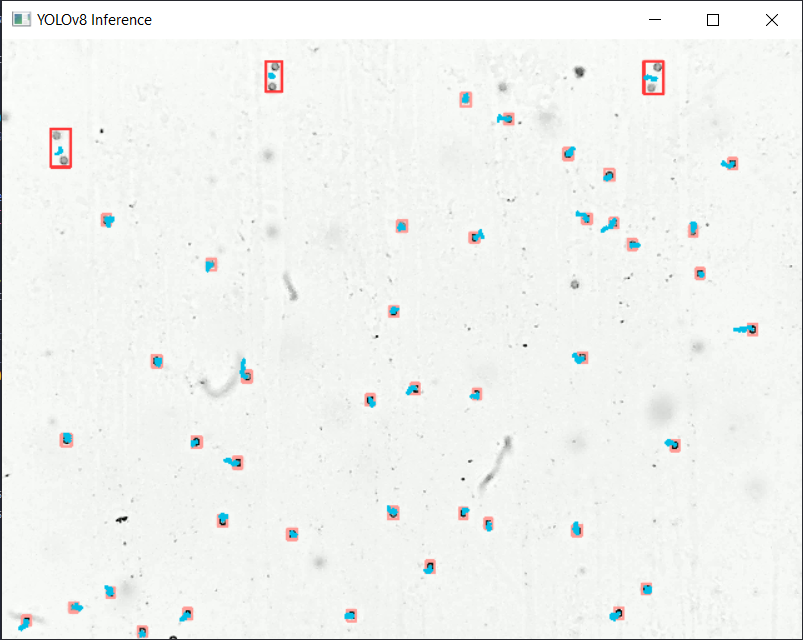

## Particle tracker trained with YOLOv8 on custom dataset containing labeled images of 1μm & 2μm diameter polysterene microspheres suspended in water. ##

Tracks particles in brownian motion for the purpose of calculating the Boltzmann constant. Done in collaboration with colleagues from the physics department @ UCY.

Detects & classifies 3 different classes: "dark", "holy" and "double".\
\
Particles classified as "holy" appear to have a hole in them as a result of their position related to the microscope or the glass cover slip (out of observable range for the specific settings.

Particles classified as "double" are pairs of particles that are too close to each other such that forces acting between the particles interfere with the "randomness" we are trying to observe in brownian motion

Particles classified as "dark" are the ones we mostly care about.

## Details about experiment configuration and results can be found in the [lab report](BrownianMotion_report.pdf). ##

> Example of tracking 2um particles. 
